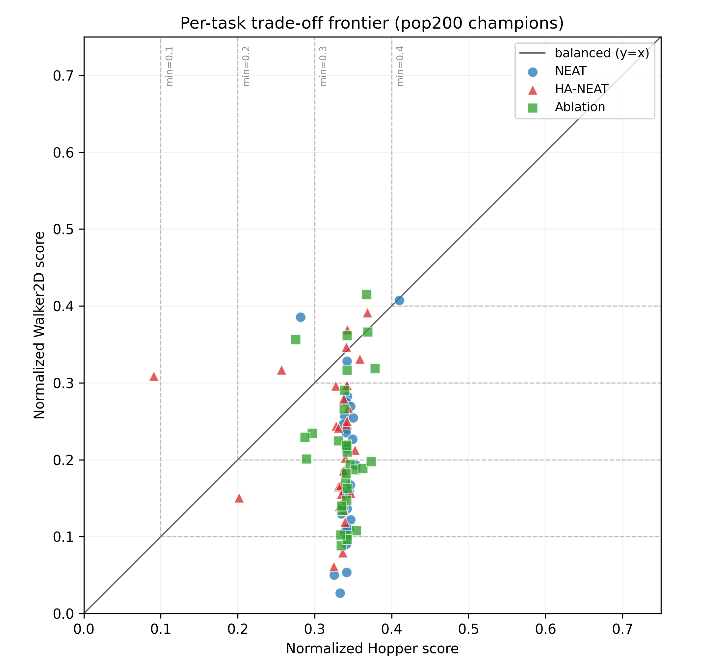
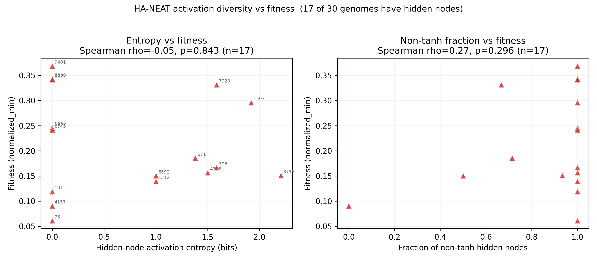

# Per-task trade-off & HA-NEAT activation analysis (pop200)

Champions: 3 conditions x 30 seeds = 90 genomes. Per-task scores are the normalized episode returns (20 eval episodes/task) from `combined.json`; `normalized_min = min(hopper, walker2d)` is the training objective.

## 1. Per-task trade-off frontier

| Condition | n | median Hopper | median Walker2D | median min-fit | median imbalance |Hop-Wal| | IQR imbalance | Walker-bottleneck frac |
|---|---|---|---|---|---|---|---|
| NEAT | 30 | 0.342 | 0.183 | 0.183 | 0.159 | [0.097, 0.220] | 0.97 |
| HA-NEAT | 30 | 0.338 | 0.227 | 0.208 | 0.117 | [0.053, 0.186] | 0.83 |
| Ablation | 30 | 0.342 | 0.199 | 0.199 | 0.142 | [0.065, 0.190] | 0.90 |

Kruskal-Wallis on per-genome imbalance |Hopper - Walker2D| across the 3 conditions: H = 3.389, p = 0.184.

Walker-bottleneck fraction = share of champions with Walker2D < Hopper (i.e. Walker2D is the limiting task that sets normalized_min).

## 2. HA-NEAT activation entropy vs fitness

Of 30 HA-NEAT champions, 17 have >=1 hidden node and 13 have zero hidden nodes (activation distribution undefined; excluded from correlations).
Zero-hidden seeds: [7, 21, 42, 404, 505, 2164, 2444, 3081, 4421, 5213, 6522, 9303, 9355].

Median fitness — with hidden nodes: 0.186; zero hidden nodes: 0.213.

- Spearman(entropy, fitness): rho = -0.052, p = 0.843 (n = 17).
- Spearman(non-tanh fraction, fitness): rho = 0.269, p = 0.296 (n = 17).

Per-genome activation detail (genomes with hidden nodes):

| seed | n_hidden | entropy (bits) | non-tanh frac | fitness | counts |
|---|---|---|---|---|---|
| 9401 | 1 | 0.000 | 1.000 | 0.369 | {'identity': 1} |
| 8038 | 1 | 0.000 | 1.000 | 0.342 | {'sigmoid': 1} |
| 202 | 1 | 0.000 | 1.000 | 0.341 | {'sigmoid': 1} |
| 7920 | 3 | 1.585 | 0.667 | 0.331 | {'tanh': 1, 'sigmoid': 1, 'relu': 1} |
| 1597 | 6 | 1.918 | 1.000 | 0.296 | {'sigmoid': 2, 'relu': 1, 'sin': 1, 'identity': 2} |
| 123 | 1 | 0.000 | 1.000 | 0.246 | {'identity': 1} |
| 1227 | 1 | 0.000 | 1.000 | 0.244 | {'sigmoid': 1} |
| 8745 | 1 | 0.000 | 1.000 | 0.242 | {'sin': 1} |
| 871 | 7 | 1.379 | 0.714 | 0.186 | {'tanh': 2, 'relu': 4, 'identity': 1} |
| 303 | 6 | 1.585 | 1.000 | 0.167 | {'sigmoid': 2, 'relu': 2, 'sin': 2} |
| 4335 | 4 | 1.500 | 1.000 | 0.156 | {'sigmoid': 2, 'relu': 1, 'sin': 1} |
| 3715 | 15 | 2.206 | 0.933 | 0.151 | {'tanh': 1, 'sigmoid': 3, 'relu': 4, 'sin': 3, 'identity': 4} |
| 6592 | 2 | 1.000 | 0.500 | 0.150 | {'tanh': 1, 'sin': 1} |
| 1312 | 2 | 1.000 | 1.000 | 0.140 | {'relu': 1, 'identity': 1} |
| 101 | 2 | 0.000 | 1.000 | 0.119 | {'identity': 2} |
| 4157 | 1 | 0.000 | 0.000 | 0.091 | {'tanh': 1} |
| 75 | 1 | 0.000 | 1.000 | 0.061 | {'relu': 1} |

## Interpretation

Even though the conditions do not differ in min-fitness (KW p=0.476 in the main analysis), all three place Walker2D as the bottleneck task and produce similarly lopsided champions: the imbalance distributions are statistically indistinguishable, so conditions are not solving the trade-off in qualitatively different ways. Within HA-NEAT, activation diversity is largely unused — roughly half the champions evolve no hidden nodes at all, and among those that do, neither activation entropy nor non-tanh fraction shows a significant monotonic relationship with fitness. With only ~16 informative genomes the test is underpowered, but the point estimate gives no evidence that heterogeneous activations are the lever driving success on this task.
